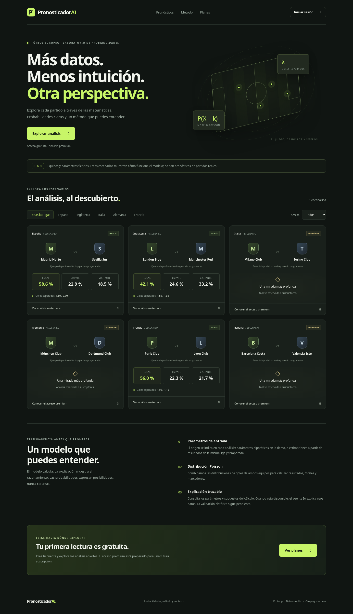

# PronosticadorAI

Prototipo web en español para explorar probabilidades de fútbol europeo, con acceso gratuito y controles de acceso premium. Incluye registro, inicio/cierre de sesión, filtros por liga, análisis Poisson y explicación del método.

## Vista del diseño

Capturas reales de la aplicación ejecutada en Chromium, en modo demo con datos sintéticos. Son imágenes del diseño, no una web desplegada.

[Ver escritorio](docs/capturas/escritorio.png) · [Ver móvil](docs/capturas/movil.png)



## Desarrollo

Requiere Node.js 24.19 o superior, con `node:sqlite` y `--use-env-proxy`. No hay dependencias externas, instalación npm ni compilación.

```sh
cd /workspace/PronosticadorAI
npm test
npm run dev
```

`npm start` inicia el servidor sin vigilancia de archivos. El puerto por defecto es 3000 y la dirección de escucha es 127.0.0.1. Variables opcionales: `PORT`, `HOST`, `DATA_DIR` y `COOKIE_SECURE=true` para HTTPS. El modo demo no necesita claves. La base SQLite se guarda en `.data/app.sqlite`, ignorada por Git. Conserva esa carpeta para retener las cuentas; no publiques bases de datos con usuarios reales en una imagen compartida de desarrollo.

## Qué funciona

- Registro con email y contraseña de 10–128 caracteres; hash scrypt con sal aleatoria.
- Sesiones persistentes con cookie HttpOnly/SameSite y tokens almacenados mediante hash.
- Protección de solicitudes de escritura por origen y limitación de intentos de autenticación por IP.
- Pronósticos públicos gratuitos; los cálculos premium no se envían a usuarios sin acceso.
- Poisson independiente para 1X2, más de 2,5 goles, ambos marcan y cinco marcadores más probables.
- Filtros por país y tipo de acceso, diseño adaptable y diálogos de cuenta y análisis.

## Datos: API-Football (API-Sports)

Hasta la primera sincronización exitosa se muestran seis escenarios sintéticos. No se anuncian resultados predictivos validados.

Proveedor elegido por el usuario: [API-Football](https://www.api-football.com/), mediante su API directa API-Sports. Base HTTPS: `https://v3.football.api-sports.io`. Configura `API_FOOTBALL_KEY` como secreto con destino `v3.football.api-sports.io`. Se envía en la cabecera `x-apisports-key`. `www.api-football.com` es la web del proveedor, no la base para consultar datos.

La integración espera una clave del panel API-Sports. Si tu suscripción se adquirió mediante RapidAPI, ese acceso requiere otro host y cabeceras: indica que usas RapidAPI antes de introducir la clave en esta conexión. No se ha comprobado todavía el acceso autenticado a tu cuenta ni la redistribución comercial permitida por tu contrato.

```sh
cd /workspace/PronosticadorAI
npm run sync
```

Para cada liga, se descubre la temporada actual con `/leagues?id=...&current=true` y después se consultan sus partidos con `/fixtures?league=...&season=...`. IDs de las ligas: España 140, Inglaterra 39, Italia 135, Alemania 78, Francia 61. Son diez peticiones secuenciales en una sincronización sin páginas adicionales; la cuota depende de tu plan. Los errores del proveedor se detectan incluso si vienen con HTTP 200. Un error conserva la instantánea previa y las cuentas.

Se normalizan los partidos y los goles de `score.fulltime`. Solo se entrena con partidos finalizados `FT` de la misma liga y temporada anteriores a la consulta y al partido. Se excluyen prórrogas, penaltis, partidos en juego, suspendidos y sin datos completos. Se publican los partidos `NS` de los próximos siete días con suficiente historia: al menos treinta partidos de liga y tres partidos relevantes por equipo. La primera estimación disponible por liga es gratuita; las restantes requieren premium.

Las tasas por equipo se regularizan con cinco partidos equivalentes al promedio de la liga. Si `H` y `A` son los promedios de goles local y visitante:

- `lambda_local = tasa_local_marca_en_casa * tasa_visitante_recibe_fuera / H`.
- `lambda_visitante = tasa_visitante_marca_fuera * tasa_local_recibe_en_casa / A`.
- Cada tasa = `(goles_observados + 5 * promedio_liga_correspondiente) / (partidos + 5)`.

Cada análisis muestra muestra, temporada, proveedor y fecha de consulta. Son estimaciones exploratorias: no hay backtest ni intervalos de incertidumbre. La sincronización es manual: ejecútala diariamente y antes de publicar pronósticos. Las visitas no generan consultas a la API. Una instantánea sin partidos futuros no se sustituye silenciosamente por ejemplos ficticios. No se integran todavía cuotas, lesiones o alineaciones.

La antigua instantánea de football-data.org, si existe, conserva su atribución hasta completar una sincronización nueva. El adaptador anterior queda como código de referencia, pero `npm run sync` usa API-Football y no utiliza `FOOTBALL_DATA_TOKEN`.

## Agente de explicación: OpenAI

Configura el secreto `PRONOSTICADOR_AI_KEY` con destino `api.openai.com`. Este nombre evita el prefijo `OPENAI_`, reservado por la plataforma. Modelo por defecto: `gpt-4.1-mini`; `AI_MODEL` permite seleccionar otro que admita Responses y salida JSON estructurada. El modelo debe estar disponible para tu cuenta y puede generar costes.

Un usuario registrado puede solicitar la explicación desde el análisis. La ruta `POST /api/forecasts/:id/explanation` comprueba también el acceso premium. Los parámetros y probabilidades salen del servidor; la petición del navegador no puede reemplazarlos. OpenAI recibe solo la evidencia deportiva y sus supuestos, sin datos personales del usuario. Usa `POST /v1/responses` según el [contrato oficial de Responses](https://github.com/openai/openai-node/blob/master/src/resources/responses/responses.ts), `store:false` y salida JSON estricta; no se confía en números generados por el agente. Los valores numéricos se muestran directamente desde el motor matemático.

La respuesta indica proveedor, modelo, fecha y que el texto puede tener errores. Un fallo de IA se muestra como fallo y mantiene disponible el cálculo matemático. Las explicaciones se guardan en SQLite por huella de la evidencia, versión del prompt y modelo. Las solicitudes simultáneas se agrupan. Hay límites por proceso de tres solicitudes por usuario por minuto y veinte llamadas nuevas al proveedor por hora; no sustituyen los límites de gasto del proveedor y se reinician al reiniciar el servidor.

El servidor conserva el uso del proxy de entorno (`--use-env-proxy`), TLS y verificación de certificados. Los clientes no siguen redirecciones de solicitudes autenticadas. No se ha completado una consulta real a ninguno de los dos proveedores: faltan las claves. Las rutas API responden sin autenticación (proveedor anterior de fútbol: HTTP 403; OpenAI: HTTP 401), lo cual no verifica la autorización de una cuenta.

El modelo supone goles independientes y una tasa constante por equipo. Se controla la masa residual al truncar cada distribución (<1e-12) y se renormaliza. La suma 1X2 es uno salvo precisión numérica. Los cinco marcadores mostrados no cubren todos los resultados.

## Suscripciones

El registro siempre crea una cuenta gratuita. Existe autorización premium en el servidor, pero **no hay checkout, cobros ni activación de suscripciones en la interfaz**. No se ha decidido un precio. Los tests verifican ambos niveles con una base temporal; no hay una ruta pública para cambiar de plan.

Para monetizar hace falta integrar un proveedor de pagos con checkout y webhooks verificados, asociar el cliente con el usuario y sincronizar altas, cancelaciones y caducidad. No activar premium basándose en parámetros del navegador o en una página de pago completado.

## Próximos pasos para una versión real

1. Configurar las claves y acceso de red de API-Football y OpenAI; verificar una sincronización y una explicación reales.
2. Evaluar el modelo cronológicamente con Brier, pérdida logarítmica y calibración frente a una referencia, con datos disponibles en cada momento histórico.
3. Revisar calidad y fidelidad de las explicaciones IA sobre partidos reales.
4. Definir precio y proveedor de pagos, e implementar el ciclo de suscripción.
5. Preparar despliegue HTTPS, copias de seguridad, verificación de email, recuperación de cuenta y controles operativos antes de abrir el servicio al público.

## Validación

`npm test` compara mercados con fórmulas analíticas y prueba registro, sesiones, bloqueo premium, protección de origen, estimación sin resultados futuros y separación demo/API. Los proveedores se prueban con respuestas simuladas: contratos de petición, errores, salida estructurada, caché y flujo HTTP del agente. Usa bases temporales, no modifica cuentas de desarrollo y no genera llamadas de pago. No constituye acceso real verificado, un backtest deportivo ni una prueba completa de navegador.
